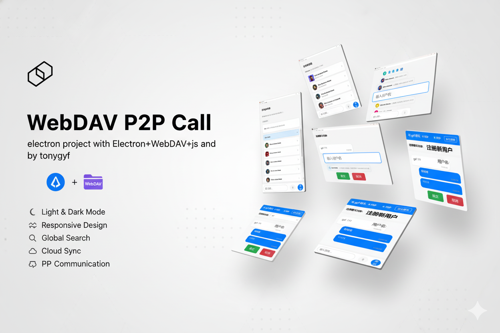

# WebDAV P2P Call

<p align="center">
  
  
  
  
</p>

<p align="center">
  
</p>

> 🚀 一款现代化的点对点通话与聊天桌面应用，基于 Electron 构建，并使用 WebDAV 作为安全、去中心化的存储后端。

---

## ✨ 核心特性

- **端到端加密**: 所有通信内容均采用 `AES-256-CBC` 加密，确保您的对话私密安全。
- **实时通信**: 支持高质量的实时音视频通话和即时消息同步。
- **文件安全传输**: 加密传输文件，保护您的数据不被泄露。
- **数据自持**: 通过 WebDAV 协议，将所有数据存储在您自己的云存储或服务器上，实现完全的数据主权。
- **跨平台支持**: 完美运行于 Windows、macOS 和 Linux。
- **现代化 UI**: 简洁、美观的用户界面，提供流畅的操作体验。

---

## 🛠️ 技术栈

- **核心框架**: [Electron](https://www.electronjs.org/)
- **存储后端**: [WebDAV](https://github.com/perry-mitchell/webdav-client)
- **主要语言**: Node.js, JavaScript, HTML5, CSS3

---

## 🚀 快速开始

### 1. 前置条件
- **Node.js**: `v16` 或更高版本
- **包管理器**: `npm`, `pnpm` 或 `yarn`

### 2. 安装与启动

```bash
# 1. 克隆仓库
git clone <repository-url>
cd webdav-p2p-call

# 2. 安装依赖
npm install

# 3. 启动应用
npm start
```

---

## ⚙️ 配置指南

在项目根目录下，编辑 `config.js` 文件，填入您的 WebDAV 服务器信息和加密密钥。

```javascript
module.exports = {
  webdav: {
    url: 'https://your-webdav-server.com/dav', // 您的 WebDAV 服务器地址
    username: 'your-username',               // 用户名
    password: 'your-password'                // 密码
  },
  encryption: {
    secret: 'your-encryption-secret'         // 用于生成加密密钥的私密字符串
  }
};
```

---

## 🔐 安全说明

- **消息与文件加密**: 所有消息和文件均在客户端使用 `AES-256-CBC` 算法进行端到端加密。
- **密钥管理**: 加密密钥由您的 `secret` 在本地生成，仅保存在客户端，服务端无法解密任何数据。
- **信令安全**: 通话信令与媒体内容在传输过程中均经过加密。

---

## 🤝 贡献指南

我们欢迎任何形式的贡献！如果您有好的想法或建议，请随时提交 Pull Request 或 Issue。

1.  **Fork** 本仓库
2.  创建您的特性分支 (`git checkout -b feature/AmazingFeature`)
3.  提交您的更改 (`git commit -m 'Add some AmazingFeature'`)
4.  推送到分支 (`git push origin feature/AmazingFeature`)
5.  提交 **Pull Request**

---

## 📄 许可证

本项目基于 MIT 许可证。详情请参阅 `LICENSE` 文件。

© 2025 tonygyf
